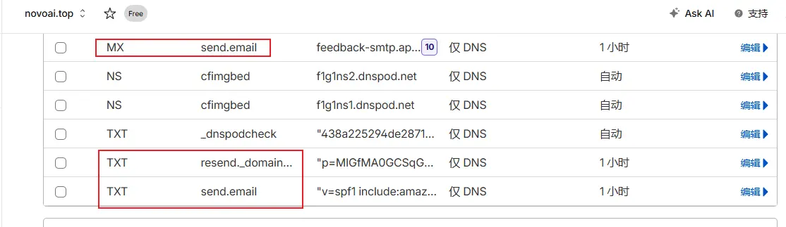
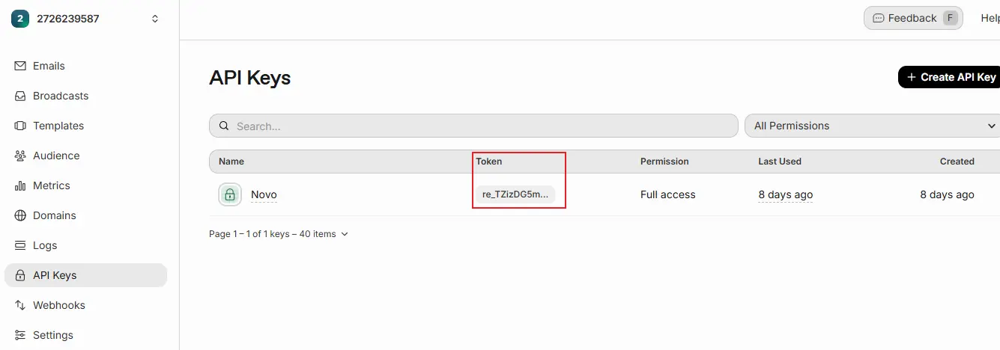
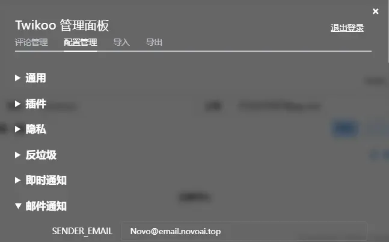

## 关于 Resend

Resend 是一款面向开发者的邮件发送服务（API-first），主打简单集成、高送达率和对无服务器环境的良好支持。常见用途包括注册/验证邮件、重置密码、订单与交易通知、系统告警，以及站点/应用内通知（例如评论邮件提醒），免费额度充足（每天 100 封，对于我个人博客的评论邮件通知完全够用）。


本文将重点介绍：注册 Resend、配置发件域名、生成 API Key、发送测试，以及如何将 Resend 配置到 Twikoo 实现评论邮件通知。

## 一. 注册与初始配置

1) 注册账号：访问 https://resend.com/ ，使用邮箱/GitHub/Google登录并完成邮箱验证。免费额度适合轻量通知场景（文档以官网为准）。

2) 登录后进入 `Domains` -> `Add domain`，建议使用子域名（例如 `mail.yourdomain.com` 或 `news.yourdomain.com`），与网站主域分离更安全。

3) Resend 会给出若干 DNS 记录（通常是 SPF 的 TXT、_domainkey 的 CNAME、以及可选的 DMARC TXT），在 Cloudflare 托管的主域名下把这些记录手工添加，或使用 Resend 的 Cloudflare 授权一键添加功能。


4) 等待 DNS 生效（几分钟到数小时），回到 Resend 控制台点击 `Verify domain`，显示 `Verified` 即可在该域名下发信。

5) 在 `API Keys` 页面创建 API Key（例如命名为 `twikoo-prod`），生成后请立即复制并存放在安全处（只显示一次）。


## 二. 发送方式与测试

推荐在后端或 Serverless 环境使用官方 SDK 或 HTTP API 发送邮件，避免在浏览器端暴露 API Key。

1) Node（官方 SDK）示例：

```bash
npm install resend
```

```js
import Resend from 'resend';
const resend = new Resend(process.env.RESEND_API_KEY);

await resend.emails.send({
  from: 'Site Name <no-reply@mail.yourdomain.com>',
  to: 'you@example.com',
  subject: '测试邮件 — Resend',
  html: '<p>发送成功</p>',
});
```

2) HTTP API（curl）示例：

```bash
curl -X POST https://api.resend.com/emails \
  -H "Authorization: Bearer $RESEND_API_KEY" \
  -H "Content-Type: application/json" \
  -d '{"from":"no-reply@mail.yourdomain.com","to":"you@example.com","subject":"测试","html":"<p>hi</p>"}'
```

3) 可选：Resend 支持 SMTP（smtp.resend.com），便于兼容传统客户端或系统。

验证发送结果：登录 Resend 控制台 `Emails` 页面查看发送状态（Sent/Delivered/Bounced）并排查问题。

## 三. 在 Twikoo 中配置评论邮件通知

1) 进入Twikoo评论管理后台，点击配置管理-邮件通知。


2) 填写SENDER_EMAIL、SMTP_SERVICE、SMTP_PASS参数，其他留空后保存，评论即可收到邮件通知。

    `SENDER_EMAIL`：任意名+Resend添加域名（例如 `novo@mail.novoai.top`）。

    `SMTP_SERVICE`：resend

    `SMTP_PASS`：Resend生成的API Key（例如 `resend_prod_xxx`）

3) 在通用页面中配置BLOGGER_EMAIL用于接受评论邮件通知。

4) 带有图片的评论邮件通知可能会被识别为垃圾邮件，导致被过滤，可以在邮件接收方添加发件人到白名单。


