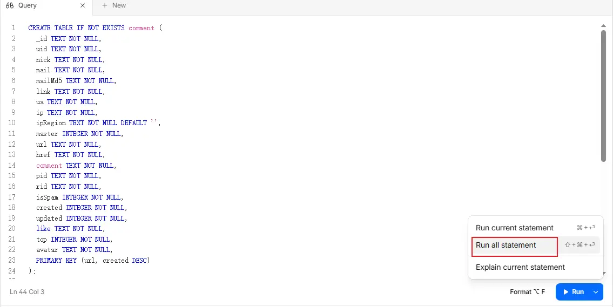
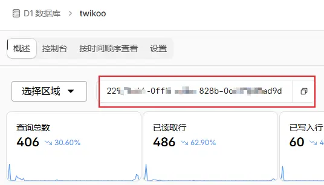
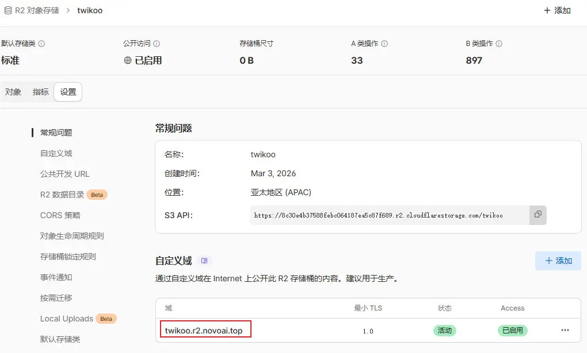
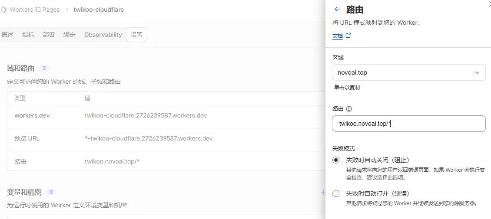
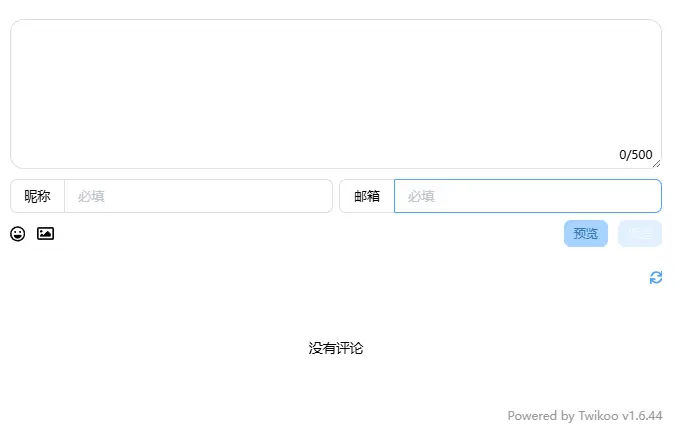

## 简介

Twikoo 是一个轻量且美观的评论系统，本文介绍基于 Cloudflare 的部署方案（使用 Worker + D1 + R2）。优点是：不需要额外托管服务器、在国内访问稳定，并且和 Cloudflare 的存储/函数安全集成。

本文适用场景：你已有一个支持接入Twikoo功能的静态博客，如Mizuki，并拥有 Cloudflare 帐号；拥有自定义域名(可选)以绑定 Twikoo 服务。

## 一、准备工作

- GitHub 账号（用于 Fork/托管 twikoo-cloudflare 源码）
- Cloudflare 账号（用于创建 D1、R2、Workers、Turnstile）
- 可选：一个域名（用于绑定 R2 或 Worker 的自定义域）

## 二、Fork 并初始化仓库

1. 访问仓库并 Fork：

	 - 仓库地址：https://github.com/Aholicoco/twikoo-cloudflare

2. 仓库中包含 `wrangler.toml`、`schema.sql` 等文件。

## 三、在 Cloudflare 上创建 D1（数据库）

1. 登录 Cloudflare 控制面板：`存储和数据库` -> `D1 SQL 数据库` -> `创建`，命名为 `twikoo`。
2. 创建完成后进入该数据库的 `Explore Data` 页面，复制仓库根目录 `schema.sql` 的内容到查询界面并执行 `Run all statement`（创建所需表结构）。

3. 在数据库列表页复制该数据库的 `ID`（随后替换仓库根目录 `wrangler.toml` 中的 `database_id`）。


在 `wrangler.toml` 中的示例段落（请替换为你自己的 ID）：

```toml
[[d1_databases]]
binding = "DB"
database_name = "twikoo"
database_id = "f47ac10b-58cc-4372-a567-0e02b2c3d479" # 替换为你的 D1 ID
```

## 四、创建 R2 存储（用于图片等附件）

1. Cloudflare 左侧栏选择 `R2 对象存储`，创建存储桶名 `twikoo`。
2. 进入该存储桶的 `设置` -> `自定义域`，配置一个子域（例如 `twikoo.r2.yourdomain.com`），等待激活。

3. 在 `wrangler.toml` 中加入或修改变量：

```toml
[vars]
R2_PUBLIC_URL = "https://twikoo.r2.yourdomain.com" # 替换为你设置的域名或 R2 公共 URL
```

（如果不使用自定义域，也可以暂时使用 R2 的默认访问地址，但建议绑定自有域名以避免跨源或访问限制）

## 五、部署 Worker（Twikoo 云函数）

1. 在 Cloudflare 控制台中进入 `Workers 和 Pages` -> `创建 Worker`，并连接你 Fork 的仓库。
2. 在连接仓库时，选择 `main`（或你使用的分支），构建/部署命令填写：

```text
npx wrangler deploy --minify
```

3. 部署成功后访问 Worker 的 URL（或你后续绑定的自定义域），应看到类似：

```json
{
	"code": 100,
	"message": "Twikoo 云函数运行正常，请参考 https://twikoo.js.org/frontend.html 完成前端的配置",
	"version": "x.x.x"
}
```

## 六、将 Worker 绑定自定义域（可选，但建议）

在 `Workers 和 Pages` 的 `域和路由` 中添加自定义域，例如 `twikoo.yourdomain.com`，完成后你的 Twikoo 服务将通过该域名对外提供 API 与文件托管，我这里选择添加路由。


## 七、在博客中启用 Twikoo（前端配置）

Mizuki 已内置 Twikoo 支持，修改站点配置即可启用（不同博客站点的配置文件不一样，自己找一下）：

- 打开 `src/config.ts`，找到 `commentConfig.twikoo.envId`，将其替换为你部署并绑定的 Twikoo 域名（包含协议），设置 `commentConfig.enable` 为 `true` 表示启用评论，示例：

```ts
export const commentConfig: CommentConfig = {
	enable: true,
	twikoo: {
		envId: "https://twikoo.yourdomain.com",
		lang: SITE_LANG,
	},
};
```

保存后重新构建/部署你的静态博客站点（例如 GitHub Pages / Cloudflare Pages），刷新博客文章页面底部，应能看到 Twikoo 评论区。


## 八、配置 Twikoo 管理面板（首次访问）

1. 点击评论区的小齿轮图标，首次进入会要求设置管理员密码。
2. 进入 `配置管理`：
	 - 在 `隐私` 中将 `IMAGE_CDN` 设置为 `cloudflare`，启用图片上传到 R2。
	 - 在 `通用` 中为 `HIDE_ADMIN_CRYPT` 设置暗号，隐藏管理入口。
     - 其他功能可自行摸索，保存配置后退出管理面板，就可以开始发表文字、图片进行评论了。


