> ⚠️ **声明**：本文仅供学习交流使用，请遵守各服务提供商的服务条款。

## 目录

- [前言](#前言)
- [Cliproxy 安装配置](#cliproxy-安装配置)
- [CC Switch 安装](#cc-switch-安装)
- [接入Claude Code](#接入Claude-Code)

---
## 前言

Claude Code 是 Anthropic 官方提供的 AI 编程助手，功能强大，但免费版本有使用限制。而 ChatGPT 的 Codex 模型（在 OpenAI API 中）同样具备强大的代码能力，且有免费额度可以使用。

本文将教你如何在 **Windows 10** 系统上部署 **Cliproxy** 和 **CC Switch**，通过反代的方式将 Codex API 配置给 Claude Code 使用。

---

## Cliproxy 安装配置

Cliproxy 是一个开源的 API 反向代理工具，支持将请求转发到 OpenAI API 兼容的后端。

### 下载解压

- 从 [CLIProxyAPI Releases](https://github.com/router-for-me/CLIProxyAPI/releases) 下载可执行文件，我这里是用win10演示，就下载windows版本。

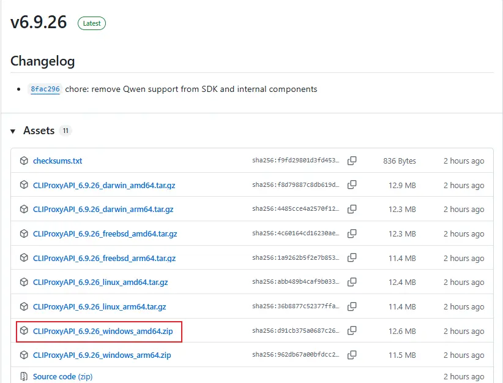

- 解压下载的压缩包

### 编辑配置

- 在解压目录下新建 `auths` 文件夹，将 `config.example.yaml` 重命名为 `config.yaml`

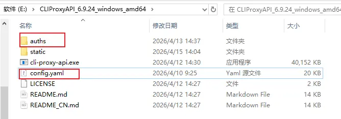

- 用文本编辑器打开 `config.yaml` ，仅需保留并修改以下基础配置项：
```yaml
port: 8317

# 文件夹位置按你的实际情况填写
auth-dir: "F:\\CLIProxyAPI\\auths"

# 用关于登录WebUI的密码
secret-key: "admin@1234"

request-retry: 3

quota-exceeded:
  switch-project: true
  switch-preview-model: true

api-keys:
# Key请自行设置，用于客户端访问代理
- "ABC-123456"
```
- 有兴趣折腾的话，具体配置和教程可参考[官方文档](https://help.router-for.me/cn/hands-on/tutorial-0.html)

#### 登录WebUI
- 双击exe执行程序启动
- 浏览器网站输入  
<http://localhost:8317/management.html#/login>  
或  
<http://127.0.0.1:8317/management.html#/login>
- 管理密钥输入前面配置文件填写的 `secret-key`,比如`admin@1234`,进行登录

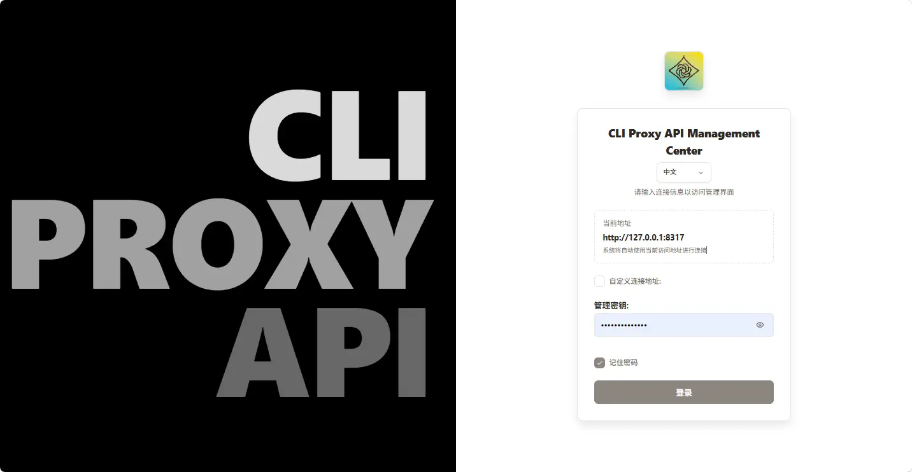

### 代理配置
- 本地部署cliproxy，因为后面要用到codex auth认证，需要先修改代理配置，将`代理URL`修改为本地魔法的端口地址

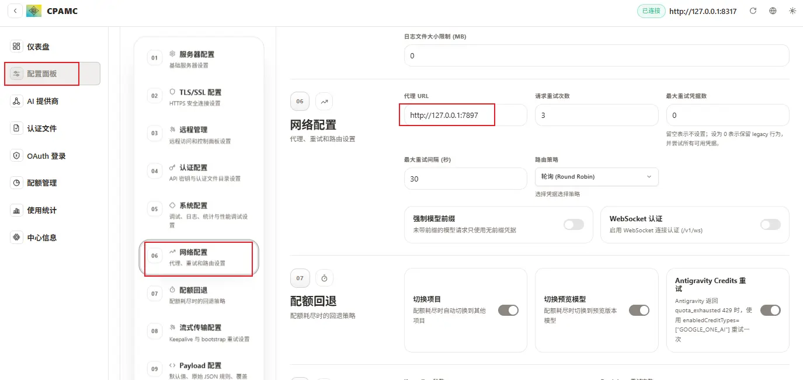

### OAuth认证
- 打开链接进行Codex OAuth登陆认证，按正常登陆Chatgpt的账号操作即可

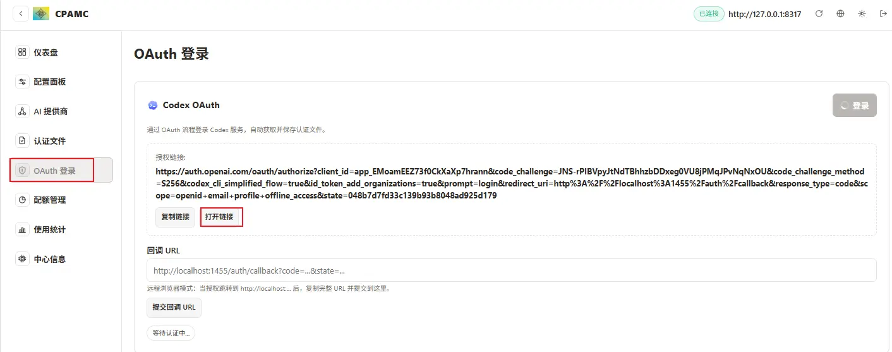

- 认证成功后，可以在`认证文件`页面查看并管理，生成的认证json文件也会保存在前面配置的本地`auths`路径，若已有多个账号的认证json，也可以在这里上传导入

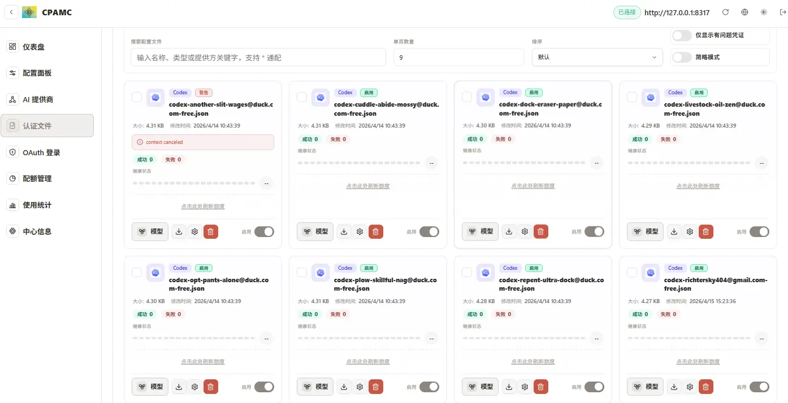

> 💡 建议：批量注册账号组成号池，效果更佳


## CC Switch 安装

CC Switch 是 Claude Code 的配置管理工具，支持快速切换 API 端点。

### 安装方式

从 [CC Switch Releases](https://github.com/farion1231/cc-switch/releases) 下载 Windows 可执行文件，进行安装即可。


## 接入Claude Code

利用CC Switch将反代的api接入Claude Code，达成Claude Code+Chatgpt模型的组合使用

### CC Switch配置 
- 打开CC Switch程序，选择Claude Code，点击`+`，添加新供应商

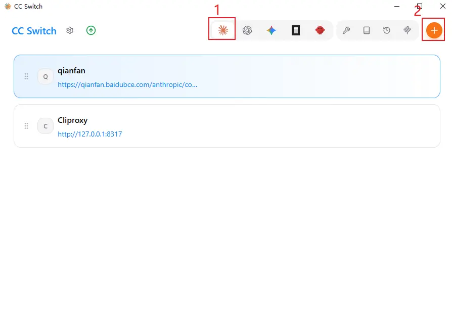

- 按图中配置填写配置   
`预设供应商`：自定义配置  
`供应商名称`：随便填  
`API Key`:前面config.yaml配置文件里的`api-keys`，比如示例中的`ABC-123456`    
`请求地址`:`http://localhost:8317`或`http://127.0.0.1:8317`  
`API 格式`:按自己需求填写，也可与图中一样  
`认证字段`:按自己需求填写，也可与图中一样

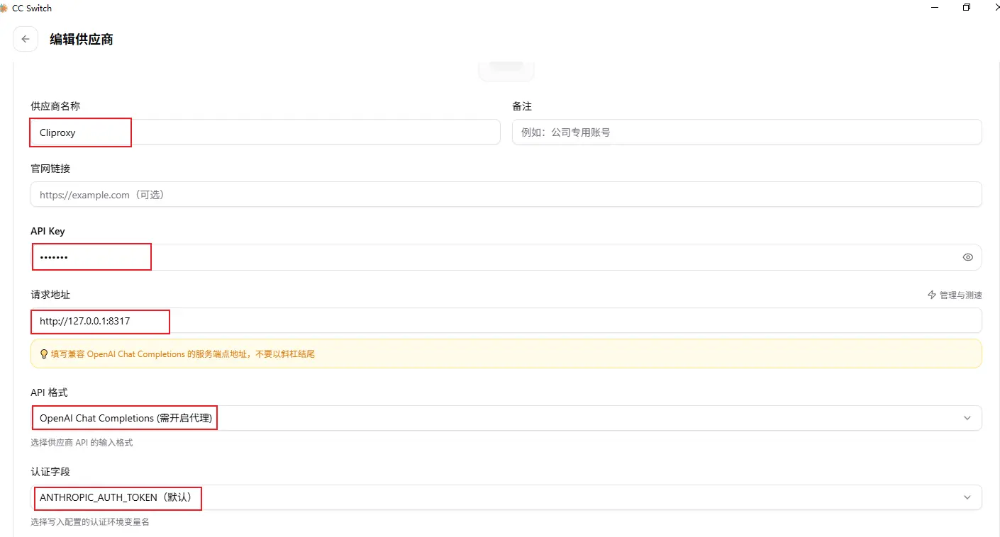

- 模型按自己需要的填写，在Cliproxy的WebUI中可以看到支持的认证模型

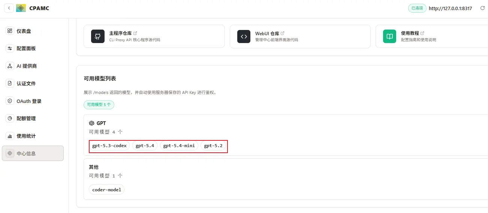

- 模型后面可以添加(minimal/medium/high/xhigh)，表示不同的推理程度

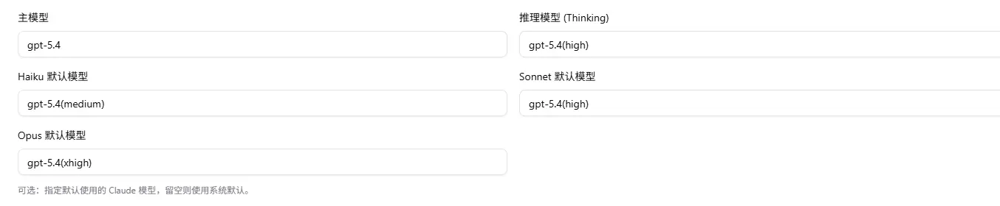

- 保存配置后进行启用

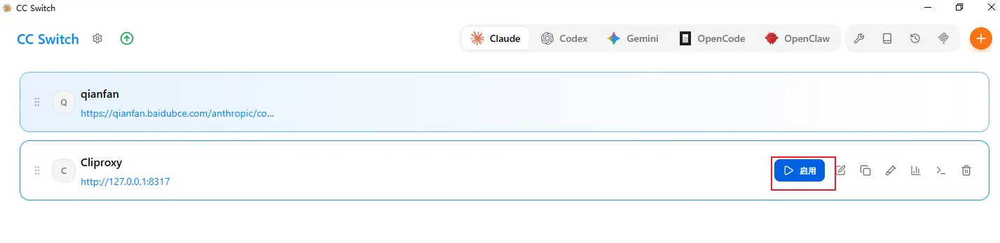


### Claude Code+Chatgpt验证

现在可以愉快的在Claude Code使用Chatgpt系列大模型了

- 以VScode中的Claude Code为例

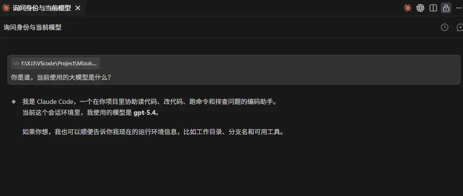

---

