Cloudflare 作为全球领先的 CDN 和边缘计算平台，在全球拥有超过 300 个数据中心。但由于网络路由、运营商策略等因素，用户默认分配到的节点可能并非最优。本文将详细介绍如何对 **Cloudflare Workers**、**Cloudflare Pages** 和 **Cloudflare R2** 进行 IP 优选，提升国内访问速度！

## 目录

- [原理概述](#原理概述)
- [公共优选域名/IP](#公共优选域名ip)
- [Pages 优选域名](#pages-优选域名)
- [Workers 优选域名](#workers-优选域名)
- [R2 的 IP 优选](#r2-的-ip-优选)

---

## 原理概述

### 什么是 IP 优选？

IP 优选是通过测试 Cloudflare 不同数据中心的 IP 地址，找到对当前网络环境延迟最低、速度最快的节点，然后通过修改 DNS 或 Hosts 的方式将域名解析到该 IP，从而实现加速访问。

### 为什么要做 IP 优选？

Cloudflare 使用 **Anycast** 技术，同一个 IP 地址在全球多个数据中心同时广播。理论上用户会自动连接到最近的节点，但实际中：

- 运营商路由策略可能导致绕路
- 国际出口拥塞影响访问质量
- 部分地区运营商对特定 IP 段有优化

通过 IP 优选，我们可以绕过这些限制，直接连接到最优节点。

---
## 公共优选域名/IP

- 社区优选域名：https://cf.090227.xyz/ ，进入地址挑选延迟较低域名即可
- 优选IP：https://github.com/XIU2/CloudflareSpeedTest ，使用大佬的工具测试出合适的IP
---

## Pages 优选域名

### 使用 DNSPod 进行优选（推荐）

#### 1. 在 Pages 中添加自定义域

进入 Cloudflare Pages 控制台：
1. 选择你的 Pages 项目
2. 点击 **设置** → **自定义域**
3. 点击 **设置自定义域**，输入你的域名（如 `page.yourdomain.com`）
4. 等待自定义域验证成功（状态显示为 **活动**）
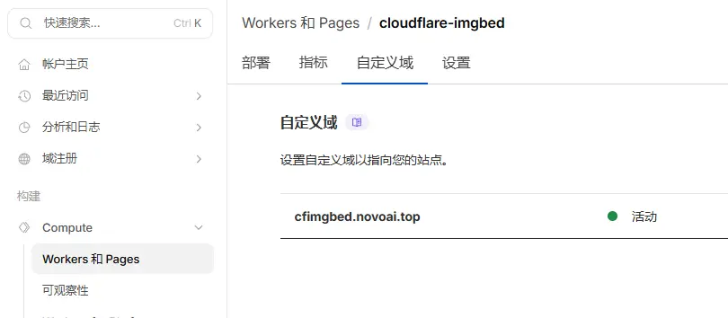

#### 2. 在 DNSPod 中添加域名

登录 [DNSPod](https://console.dnspod.cn/)：
1. 点击 **添加域名**
2. 输入你在 Pages 中添加的自定义域名
3. 点击 **确定**
4. 复制**主机记录**、**记录值**
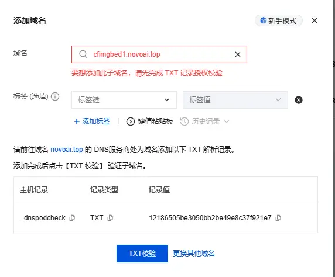

#### 3. 在 Cloudflare 添加 TXT 验证记录

由于域名托管在 Cloudflare，需要返回cloudflare，为 Pages 的自定义域名添加一条TXT验证记录，使用上面复制的**主机记录**、**记录值**即可：
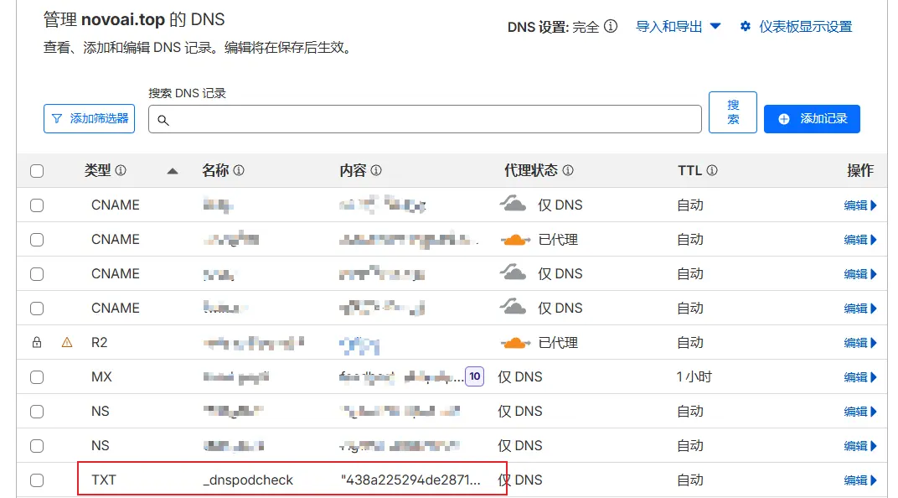

#### 4. 在 DNSPod 中验证域名

返回 DNSPod：
1. 点击 **验证**，选择 **手动验证**
2. 等待验证通过
3. 点击 **立即激活** 开启解析，提示为域名设置NS记录，复制两条NS记录

#### 5. 在 Cloudflare 添加 NS 记录

回到 Cloudflare DNS 管理：
1. 添加复制的 NS 记录，将自定义域名指向 DNSPod
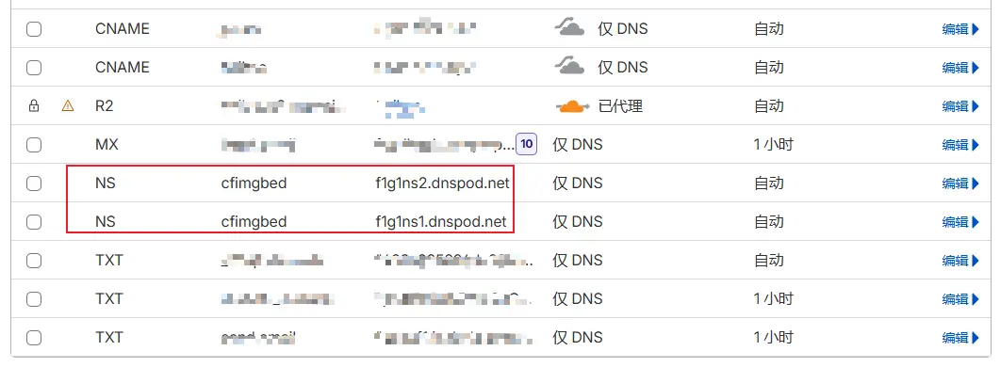

#### 6. 在 DNSPod 添加优选记录

进入 DNSPod 的解析记录页面：

1. 使用优选域名 添加CNAME记录（推荐）
2. 使用优选 IP 添加A记录
3. 建议添加3条线路，默认、国内指向优选域名/IP，境外指向pages默认分配的域名
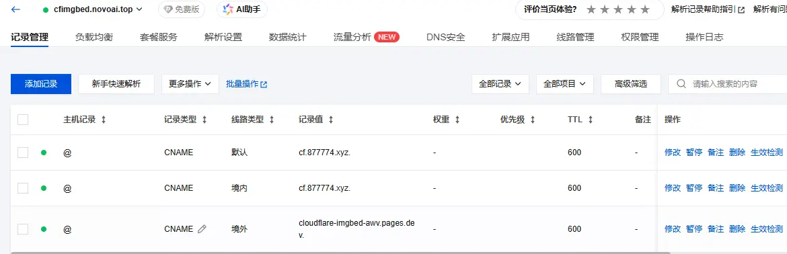

> 💡 **提示**：使用优选域名的好处是，当 IP 失效时，域名维护者会更新记录，你不需要手动修改。

---

## Workers 优选域名

Workers 的优选相对简单，使用 **Workers 路由** 功能即可。

### 使用Workers路由匹配

#### 1. 在 Cloudflare DNS 添加 CNAME 记录

进入 Cloudflare DNS 管理，添加记录将自定义域名(work.youdomian.com)指向优选域名：

| 类型 | 名称 | 目标 | 代理状态 |
|------|------|------|---------|
| CNAME | worker | cf.090227.xyz | 已禁用（灰色云）|

> ⚠️ **关键**：**代理状态必须关闭**（灰色云），否则无法实现 IP 优选！

#### 2. 添加 Workers 路由

1. 进入 Cloudflare 控制台 → **Workers 和 Pages**
2. 进入 要配置的**Workers**
3. 点击 **添加路由**
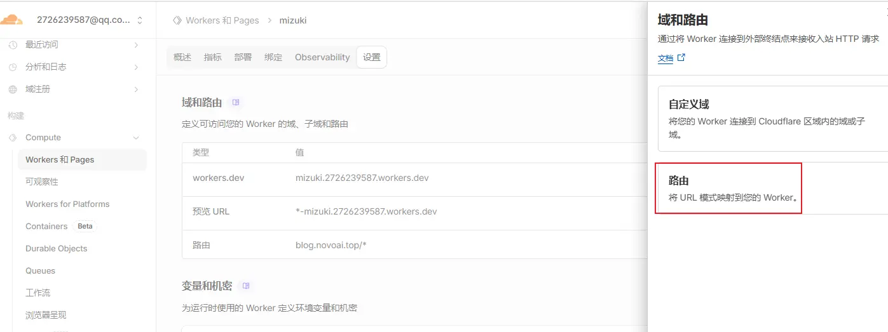

**路由配置：**
- **路由**：`worker.yourdomain.com/*` （注意加上 `/*`）
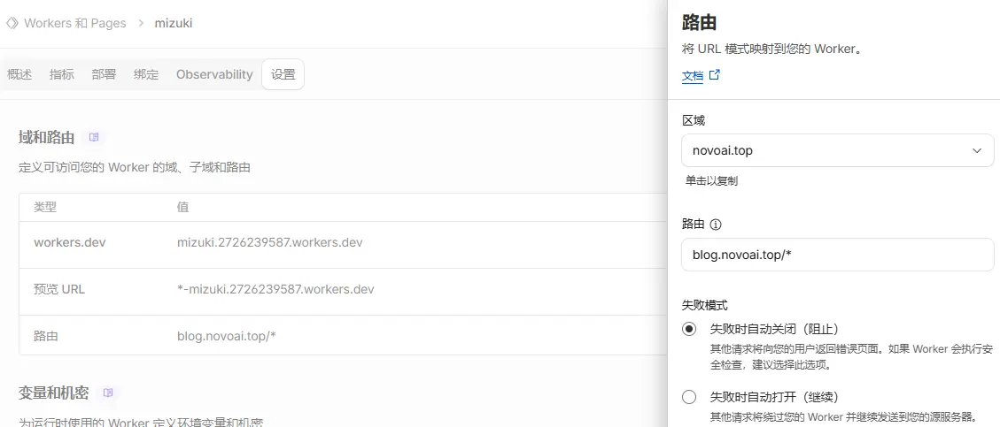

#### 3. 验证访问

等待 DNS 生效后，访问 `worker.yourdomain.com`，如果正常返回 Worker 内容，说明配置成功。

#### 4.Workers 路由匹配规则

| 路由示例 | 说明 |
|---------|------|
| `example.com/*` | 匹配所有路径 |
| `*.example.com/*` | 匹配所有子域名 |
| `example.com/api/*` | 仅匹配 `/api/` 路径 |

---

## R2 的 IP 优选

### 使用Cloud Connector配置
⚠️ **这个方案参考网上大佬的，我没成功，我使用的下面另一种方案：Workers代理加速**

#### 1. 创建 R2桶 并绑定自定义域名
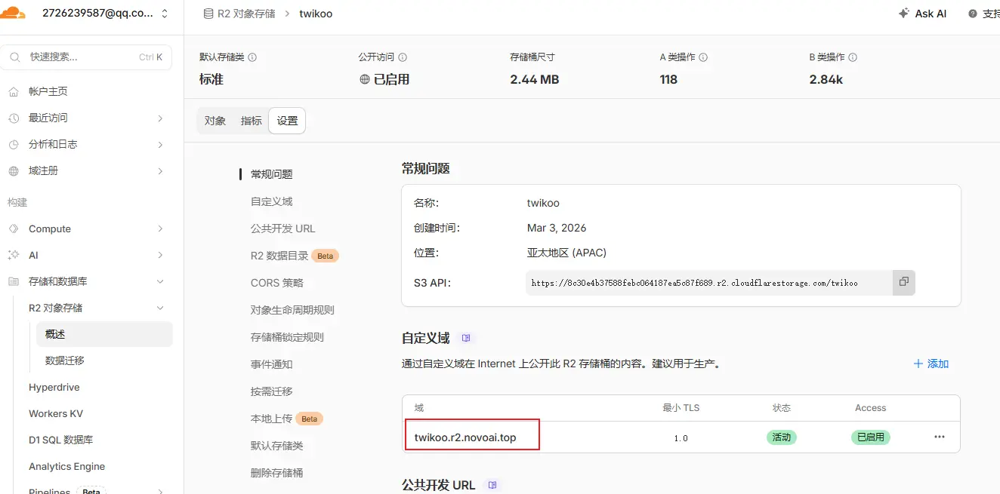

#### 2. 进入规则 - Cloud Connector - Cloudflare R2
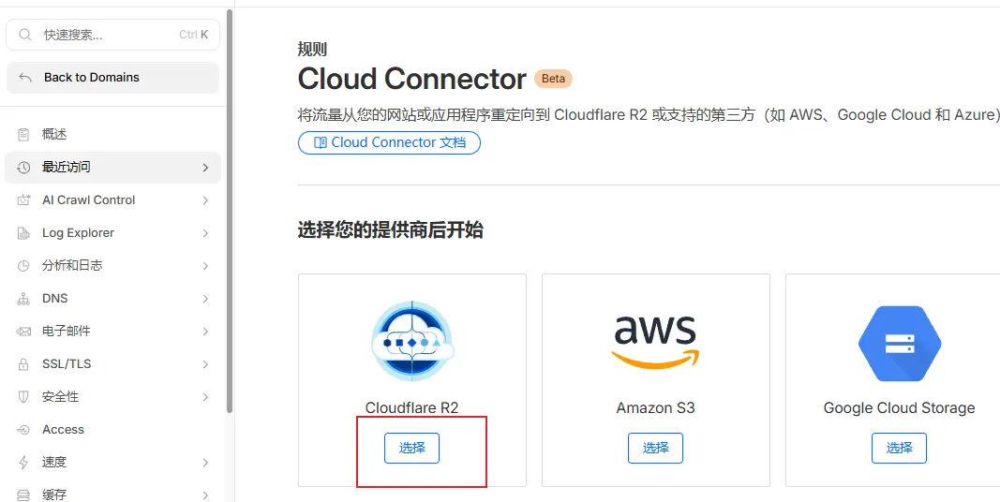

#### 3. 选择R2桶以及自定义的域名
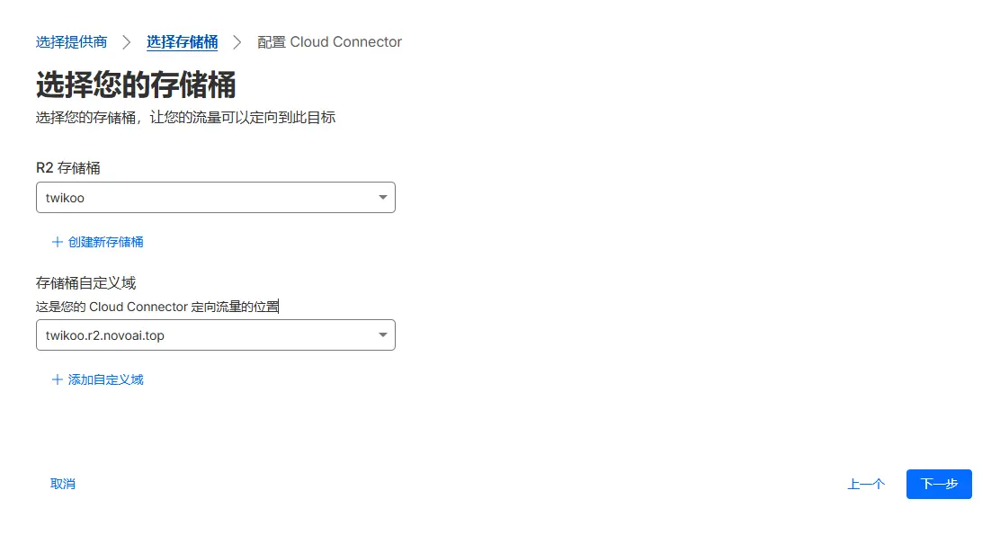

#### 4. 给R2桶域名配置CAME指向优选域名
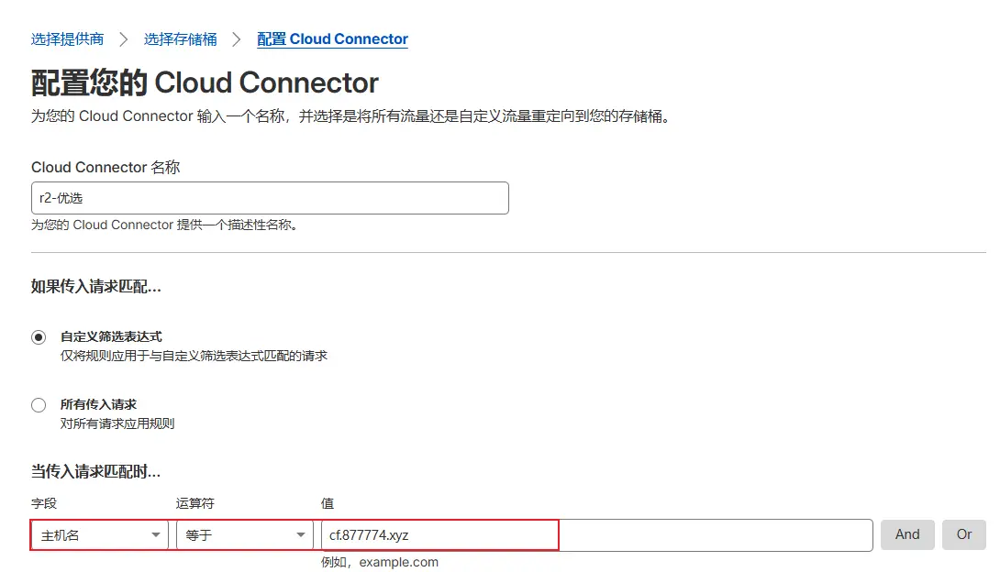


### 使用Workers代理加速
本质是通过Workers+优选IP加速访问

#### 1. 配置代理域名指向优选域名/IP
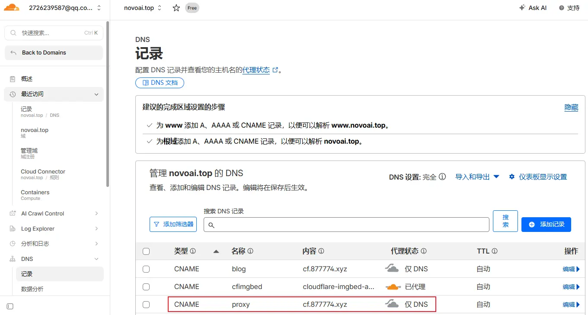

#### 2. 新建worker，写入代码后部署，用于代理
代码可根据实际情况修改，通过worker域名加速访问节点后，再去构造R2桶域名请求，由于已经完成加速，后续请求都是在CF内网完成，速度极快
```javascript
const R2_DOMAIN = 'twikoo.r2.novoai.top'; //改成你的R2桶域名
const ALLOWED_DOMAINS = ['blog.novoai.top', 'www.blog.novoai.top']; // 允许的域名列表

async function handleRequest(request) {
  try {
    const url = new URL(request.url);
    
    // ===== 防盗链检查开始 =====
    const referer = request.headers.get('Referer') || '';
    
    // 如果不是直接访问（有Referer），检查是否来自允许的域名
    // 注意：如果是直接访问图片 (无Referer)，通常也允许，或者你可以选择禁止
    if (referer !== '') {
      let isAllowed = false;
      for (const domain of ALLOWED_DOMAINS) {
        if (referer.includes(domain)) {
          isAllowed = true;
          break;
        }
      }
      
      if (!isAllowed) {
        return new Response('Hotlinking not allowed', { 
          status: 403,
          headers: { 'Content-Type': 'text/plain' }
        });
      }
    }
    
    // ===== 构造 R2 请求 =====
    const targetUrl = new URL(`https://${R2_DOMAIN}`);
    targetUrl.pathname = url.pathname;
    targetUrl.search = url.search;

    // 复制请求头，但修改 Host
    const headers = new Headers(request.headers);
    headers.set('Host', R2_DOMAIN);
    
    // 移除一些可能引起问题的跳板头
    headers.delete('cf-connecting-ip'); 
    headers.delete('x-forwarded-for');

    const newRequest = new Request(targetUrl, {
      method: request.method,
      headers: headers,
    });
    
    // ===== 发起请求并处理缓存 =====
    let response = await fetch(newRequest);
    
    // 如果请求成功 (200)，添加缓存头，让 CF 边缘节点缓存图片
    if (response.status === 200) {
      // 克隆响应对象以便修改头
      const newResponse = new Response(response.body, response);
      
      // 设置浏览器缓存 (1年)
      newResponse.headers.set("Cache-Control", "public, max-age=31536000, immutable");
      
      // 设置 CF 边缘缓存 (1年) - 关键！这样后续请求直接由 CF 返回，不运行 Worker
      newResponse.headers.set("CDN-Cache-Control", "public, max-age=31536000");
      
      // 确保内容类型正确
      if (!newResponse.headers.has("Content-Type")) {
         // 如果 R2 没返回 Content-Type，可以根据后缀简单判断，或者依赖 R2 的元数据
         // 这里假设 R2 已经存好了 Content-Type
      }
      
      return newResponse;
    }
    
    return response;
    
  } catch (err) {
    return new Response(err.stack, { status: 500 });
  }
}

addEventListener('fetch', event => {
  event.respondWith(handleRequest(event.request));
});
```
#### 3. 添加worker路由，完成worker和优选域名/IP的绑定
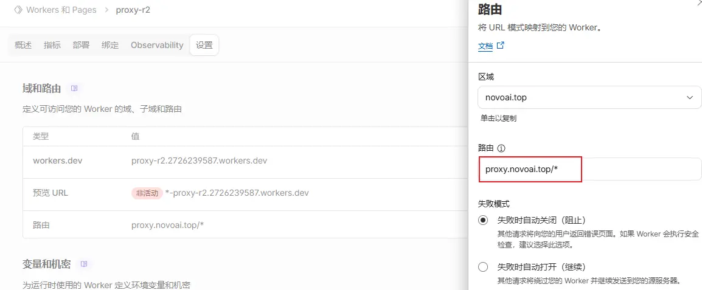

#### 4. 图片访问测速
1. 原R2桶域名访问图片延迟200ms 
- https://twikoo.r2.novoai.top/2026/03/0a81d686ef428d9bcb02d2c477b0822b.webp 
2. 使用worker加速后的代理域名访问同一图片延迟50ms 
- https://proxy.novoai.top/2026/03/0a81d686ef428d9bcb02d2c477b0822b.webp
---

